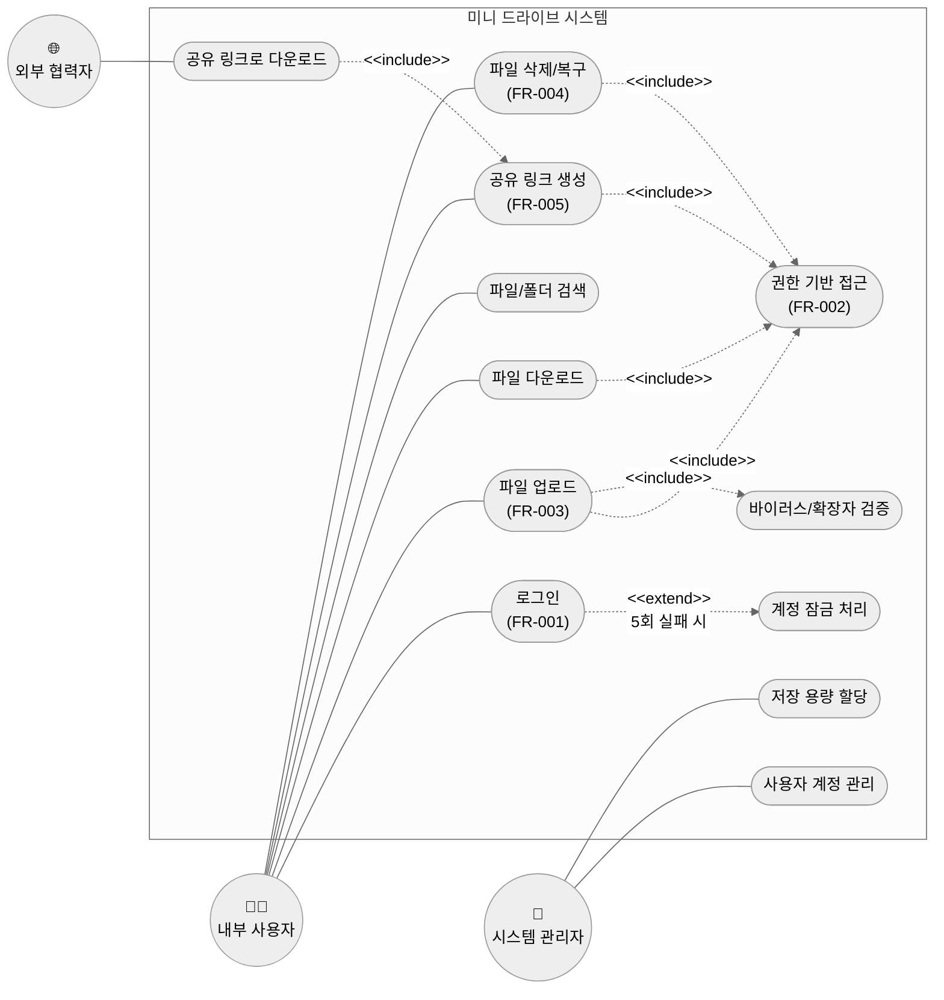
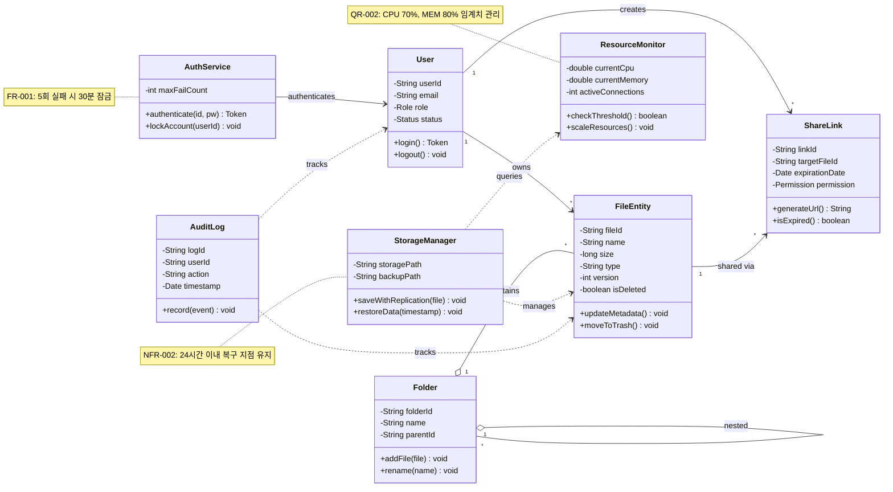
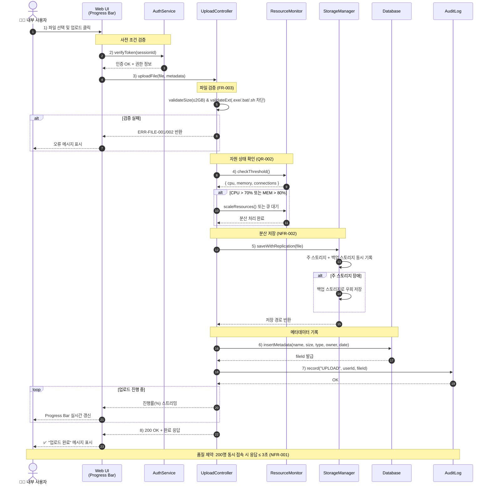

# [미니 드라이브] UML 설계서 (UML Design Document)

> 본 문서는 '클라우드 파일 공유 시스템(미니 드라이브)' 프로젝트의 분석/설계 단계 산출물로,
> **기능 관점(유스케이스)**, **구조 관점(클래스)**, **행위 관점(순차)** 의 세 가지 UML 다이어그램과 설명서를 포함합니다.
> 모든 다이어그램은 Mermaid 문법으로 작성되어 GitHub에서 별도 도구 없이 렌더링됩니다.

---

## 목차
1. [기능 관점 — 유스케이스 다이어그램](#1-기능-관점--유스케이스-다이어그램)
2. [유스케이스 설명서](#2-유스케이스-설명서)
3. [구조 관점 — 클래스 다이어그램](#3-구조-관점--클래스-다이어그램)
4. [행위 관점 — 순차 다이어그램](#4-행위-관점--순차-다이어그램)
5. [요구사항 추적 매트릭스](#5-요구사항-추적-매트릭스-traceability-matrix)

---

## 1. 기능 관점 — 유스케이스 다이어그램

요구사항 정의서(v1.3)의 **FR-001 ~ FR-005** 및 이해관계자 기대치를 기반으로,
시스템 액터를 **내부 사용자 / 외부 협력자 / 시스템 관리자**로 분류하여 작성함

    

### 1.1 액터 정의

| 액터 | 설명 | 주요 관심사 |
| :--- | :--- | :--- |
| **내부 사용자** | 조직에 소속된 직원 (팀원). 이메일/비밀번호로 인증 | 편리한 업로드·다운로드, 빠른 검색, 팀 협업 |
| **외부 협력자** | 공유 링크로만 접근하는 비조직 사용자 | 만료 기간 내 안전한 파일 접근 |
| **시스템 관리자** | 계정 생성/삭제 및 자원 할당 권한 보유 | 계정 통제, 저장 공간 할당, 감사 로그 |

### 1.2 관계 표기

- `<<include>>` : 항상 포함되는 필수 절차 (예: 모든 파일 작업은 권한 검사를 포함)
- `<<extend>>` : 특정 조건에서만 발생하는 확장 절차 (예: 로그인 5회 실패 시 계정 잠금)

---

## 2. 유스케이스 설명서

### 2.1 UC-002: 고가용성 파일 업로드 (High-Availability File Upload)

| 항목 | 상세 내용 |
| :--- | :--- |
| **유스케이스명** | 고가용성 파일 업로드 (High-Availability File Upload) |
| **유스케이스 ID** | UC-002 |
| **관련 요구사항** | FR-003, NFR-001, QR-002 |
| **관련 액터** | 내부 사용자 (Primary), 시스템 자원 모니터 (Secondary) |
| **사전 조건** | 사용자가 시스템에 로그인되어 있어야 하며, 파일 크기가 2GB 이하이고 실행 파일(`.exe`, `.bat`, `.sh`)이 아니어야 함 |
| **사후 조건** | 파일이 분산 스토리지에 저장되고 메타데이터가 DB에 기록되며, 사용자에게 완료 메시지가 전달됨 |
| **정상 흐름** | 1. 사용자가 업로드할 파일을 선택하여 요청 2. 시스템이 현재 자원(CPU/메모리) 상태를 확인하여 로드를 분산 3. 스토리지가 파일을 안전하게 분산 저장하고 메타데이터(날짜, 크기 등)를 DB에 기록 4. 사용자 UI에 실시간 진행률을 표시하고 완료 메시지 반환 |
| **대안/예외 흐름** | • [E1] 파일 크기 초과(>2GB) → 'ERR-FILE-001: 파일 크기 초과' 메시지 표시 • [E2] 차단 확장자 → 'ERR-FILE-002: 업로드 불가 파일 형식' 메시지 표시 • [E3] 자원 임계치 초과(CPU 70%/MEM 80%) → 대기열 처리 또는 자동 스케일링 호출 • [E4] 장애 발생 시 백업 스토리지로 우회하여 24시간 이내 복구 지점을 유지하도록 저장 |
| **품질 제약** | 200명 동시 업로드 요청 시에도 응답 지연 시간 **3초 이내** 유지 (NFR-001) |

### 2.2 UC-001: 사용자 로그인

| 항목 | 상세 내용 |
| :--- | :--- |
| **유스케이스명** | 사용자 로그인 |
| **유스케이스 ID** | UC-001 |
| **관련 요구사항** | FR-001, NFR-003, QR-004 |
| **관련 액터** | 내부 사용자 |
| **사전 조건** | 관리자가 계정을 사전 생성한 상태 |
| **사후 조건** | 인증 토큰이 발급되고 메인 화면으로 진입 |
| **정상 흐름** | 1. 사용자가 이메일/비밀번호 입력 2. 시스템이 입력 정보를 검증 3. RBAC 권한 정보를 함께 로드하여 세션 생성 4. 메인 화면으로 리다이렉트 |
| **대안/예외 흐름** | • [E1] 비밀번호 불일치 → 시도 횟수 +1 • [E2] 5회 실패 시 **30분간 계정 잠금** (FR-001) |
| **품질 제약** | 전송 중 SSL/TLS 암호화 필수 (NFR-003) |

### 2.3 UC-005: 공유 링크 생성 및 외부 다운로드

| 항목 | 상세 내용 |
| :--- | :--- |
| **유스케이스명** | 공유 링크 생성 및 외부 다운로드 |
| **유스케이스 ID** | UC-005 |
| **관련 요구사항** | FR-005, QR-003 |
| **관련 액터** | 내부 사용자(생성), 외부 협력자(접근) |
| **사전 조건** | 공유 대상 파일이 존재하며 사용자가 해당 파일의 공유 권한을 보유 |
| **사후 조건** | 고유 URL이 생성되고 외부 협력자가 만료일까지 파일에 접근 가능 |
| **정상 흐름** | 1. 사용자가 파일 선택 후 '공유 링크 생성' 요청 2. 권한(읽기/수정/댓글) 및 만료일 설정 3. 시스템이 고유 토큰 URL을 생성하여 반환 4. 외부 협력자가 URL 접근 → 만료 여부 검증 후 다운로드 |
| **대안/예외 흐름** | • [E1] 만료된 링크 접근 시 **'만료된 링크' 안내 페이지** 표시 (FR-005) • [E2] 권한 없는 작업 시도 시 `ERR-AUTH-001` 반환 |
| **품질 제약** | 모든 접근은 Audit Trail로 기록 (QR-003) |

---

## 3. 구조 관점 — 클래스 다이어그램

요구사항에 명시된 자원 모니터링(QR-002), 분산 저장(NFR-002), RBAC(QR-004) 개념을 클래스로 도출하였습니다.

### 3.1 클래스 책임 요약

| 클래스명 | 주요 속성 | 주요 메서드 | 역할 |
| :--- | :--- | :--- | :--- |
| **User** | userId, email, role, status | login(), logout() | 시스템 접근 주체 정의 |
| **FileEntity** | fileId, name, size, type, version, isDeleted | updateMetadata(), moveToTrash() | 파일의 메타데이터 및 상태 관리 |
| **Folder** | folderId, name, parentId | addFile(), rename() | 다단계 폴더 구조 지원 |
| **ShareLink** | linkId, targetFileId, expirationDate | generateUrl(), isExpired() | 외부 공유를 위한 상태 제어 |
| **ResourceMonitor** | currentCpu, currentMemory, activeConnections | checkThreshold(), scaleResources() | [가용성 제어] 서버 자원 임계치(70%/80%) 관리 |
| **StorageManager** | storagePath, backupPath | saveWithReplication(), restoreData() | [신뢰성 보장] 분산 저장 및 24시간 복구 지점 관리 |
| **AuthService** | maxFailCount | authenticate(), lockAccount() | 인증 및 계정 잠금 처리 |
| **AuditLog** | logId, userId, action, timestamp | record() | 파일별 접근 로그 기록 (QR-003) |

### 3.2 관계 설명

- **연관(`-->`)**: User-FileEntity (소유 관계, 1:N)
- **집합(`o--`)**: Folder가 FileEntity와 하위 Folder를 포함하나, Folder 삭제 시 내부 파일은 휴지통으로 이동 가능 (약한 결합)
- **의존(`..>`)**: StorageManager가 ResourceMonitor의 상태를 조회하여 저장 전략 결정

---

## 4. 행위 관점 — 순차 다이어그램

UC-002(고가용성 파일 업로드)의 시간 순서에 따른 객체 간 메시지 흐름을 표현합니다.

### 4.1 메시지 흐름 해설

1. **1~2단계** — 사용자가 파일을 선택하면 UI가 인증 토큰의 유효성을 먼저 확인함
2. **3단계** — Controller가 파일 크기/확장자 검증을 수행하여 차단 정책을 적용함 (FR-003).
3. **4단계** — ResourceMonitor가 CPU·메모리·연결 수를 조회해 임계치를 초과하면 자동 스케일링하거나 대기열로 보냄 (QR-002).
4. **5단계** — StorageManager가 주/백업 스토리지에 이중 저장하여 장애 시 우회 가능하도록 함 (NFR-002).
5. **6~7단계** — 메타데이터를 DB에 기록하고 AuditLog에 행위를 기록 (QR-003).
6. **반복 구간** — 업로드 중 Progress Bar가 실시간으로 % 진행률을 사용자에게 보여줌 (인터페이스 요구사항).

---

## 5. 요구사항 추적 매트릭스 (Traceability Matrix)

| 요구사항 ID | 요구사항 명 | 유스케이스 | 클래스 | 순차 다이어그램 단계 |
| :--- | :--- | :--- | :--- | :--- |
| FR-001 | 사용자 로그인 | UC-001 | AuthService, User | 2 |
| FR-002 | 권한 기반 접근 | UC-007 | User, AuthService | 2 |
| FR-003 | 파일 업로드(2GB/차단) | UC-002 | FileEntity, StorageManager | 3 |
| FR-004 | 파일 복구 및 삭제 | UC-006 | FileEntity (moveToTrash) | — |
| FR-005 | 공유 링크 관리 | UC-005 | ShareLink | — |
| NFR-001 | 200명 동시·3초 응답 | UC-002 | ResourceMonitor | 4 (전체) |
| NFR-002 | 24시간 복구 지점 | UC-002 | StorageManager | 5 |
| NFR-003 | SSL/TLS, AES-256 | 전 유스케이스 | — | 2 |
| QR-002 | CPU 70%/MEM 80% | UC-002 | ResourceMonitor | 4 |
| QR-003 | Audit Trail(로그 기록) | 전 유스케이스 | AuditLog | 7 |
| QR-004 | RBAC | UC-001, UC-007 | User.role | 2 |

---
